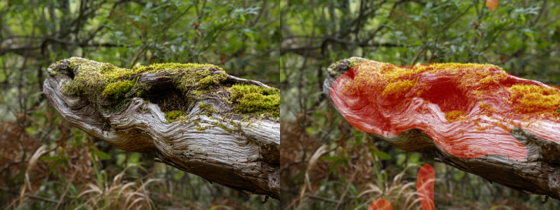

# Focus Detection

Detects areas in focus in photos, by searching for sharpest areas and then enlarging them. Focus Detection works by converting the ouput of an high-pass filter to a mask.

## To install

At the moment, the only dependencies are numpy and opencv. To install the package just do 

```
pip install .
```

## To run

Output is a file with same extension as the original file with a name suffix '_focus'

```
### run on a single image
python process.py -i input_image.jpg

### run on a directory of images
python process.py -i input_directory/ 
```

### Parameters

The algorithm used for detection is still under development. At the moment there are two main free parameters:

- high_pass_size sets the Gaussian Blur kernel size of the High Pass Filter (strength of the high-pass filter). Higher values lead to a more aggressive separation between in-focus and out-of-focus areas.

- in_focus_regions sets how many countours the recursive median blur filter should stop, ie. how many disjoint in-focus areas we want to allow in the final mask. Values of 1 and 2 may lead to over-application of median blur recursively and shrinking of focus areas found.

Experiments on 20MP images suggest values of high_pass_size=12  and in_focus_regions=3.

### Next Steps

- Build an evaluation dataset, including images with different resolution
- Train the algorithms by optimising the parameters.
- Test different kernels for the initial step.

### Inspiration

[BurDetection2](https://github.com/WillBrennan/BlurDetection2) by Will Brennan.


## Demo


